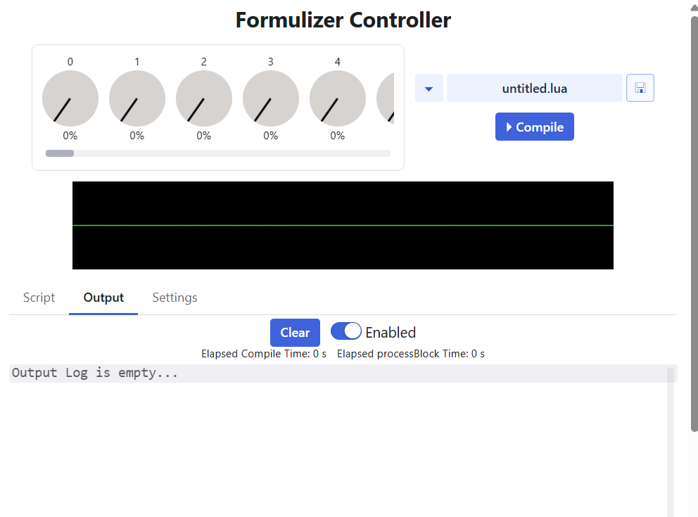
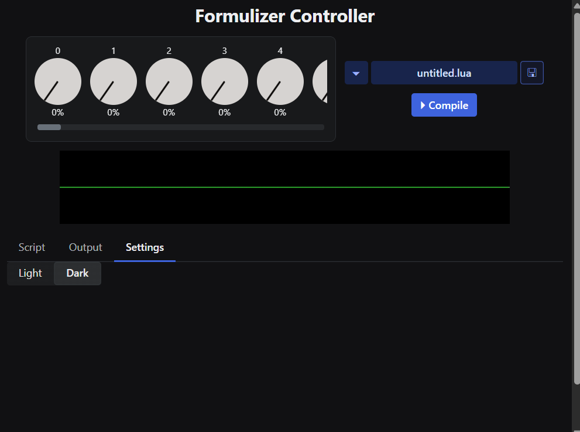

# Formulizer Controller

TODO: Make documentation

Run cmake to build

Find built executables in build/src/cpp/audioplugin_artefacts/...

- src/cpp = JUCE Plugin
- src/js = React Frontend for JUCE Plugin

How it works:
- JUCE Plugin contains LuaJIT environment and executes the most recently run script every audio processBlock() cycle
- React Frontend is packed and embedded in a WebView

React Frontend:
- Contains parameter controls
- Output log
- Signal Graph
- Monaco script editor
- File saving/loading

Demonstration:

Images:

